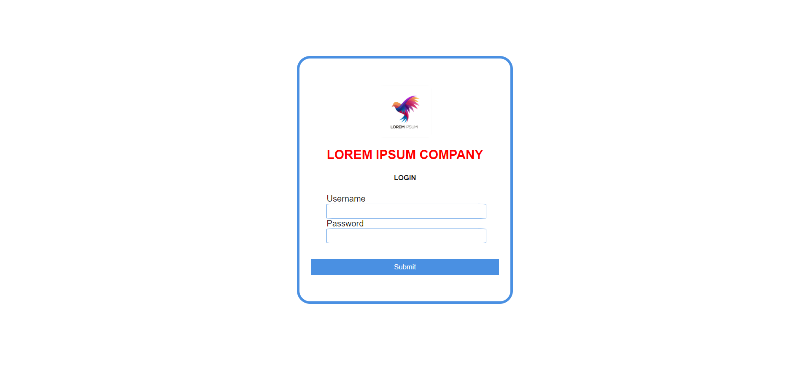

# BASIC - Login Page

## Project Description

The LOREM IPSUM COMPANY login page is designed to offer a clean and professional interface for user authentication. The page is crafted using HTML and CSS, featuring a centered login form with a modern aesthetic. It includes fields for username and password, styled to provide a user-friendly experience.

## Features

- **Modern Design**: Sleek and centered login form.
- **Responsive Layout**: Adapts to various screen sizes.
- **Custom Styling**: Personalized styles for form elements and layout.

## Visual Preview




## Technologies Used

- HTML5
- CSS3
- Google Fonts

## Setup Instructions

1. **Clone the Repository**

   ```bash
   git clone https://github.com/xreedev/basic-login.git
   ```

2. **Navigate to the Project Directory**

   ```bash
   cd basic-login
   ```

3. **Open the `index.html` File**

   You can open `index.html` in any modern web browser to view the login page.

4. **Stylesheet**

   Ensure that the `styles.css` file is in the same directory as `index.html` to apply the custom styles.

## Project Structure

- `index.html`: The main HTML file containing the login page structure.
- `styles.css`: The stylesheet for custom styling of the login page.
- `resources/logo.jpg`: The logo image used in the login page.

## Contributing

Feel free to fork the repository and submit pull requests for improvements or bug fixes. For any questions or feedback, please open an issue on the GitHub repository.

## License

This project is licensed under the MIT License - see the [LICENSE](LICENSE) file for details.

---
